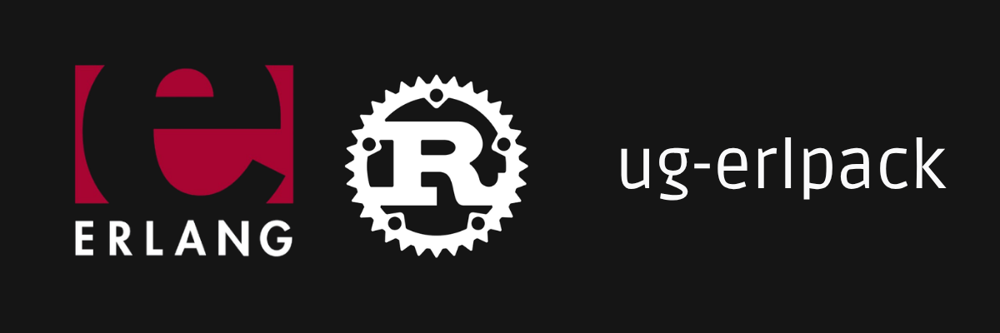

<p align="center">
  
</p>

# ug-erlpack

A Rust codec for Erlang's External Term Format (ETF), wire-compatible
with [`discord/erlpack`](https://github.com/discord/erlpack). 

The Discord desktop client connects to the gateway with
`?encoding=etf` and expects ETF frames on the WebSocket; this crate
is the codec that path is using. Web and mobile clients use `?encoding=json` and are already  served by the existing JSON path.

This crate is part of Celeste, a reimplementation of Discord's backend, it is published here as a library.

## Quick example

```rust
use serde_json::json;
use ug_erlpack::{encode, decode, convert};

let value = json!({ "op": 10, "d": { "heartbeat_interval": 41250 } });

let term = convert::from_value(&value);
let bytes = encode(&term).unwrap();

let (decoded, _) = decode(&bytes).unwrap();
let back_to_json = convert::to_value(&decoded).unwrap();
assert_eq!(back_to_json, value);
```

We match `discord/erlpack`'s emit choices byte-for-byte on every fixture we generate from the upstream Python library. The crate's test suite includes 16 fixtures produced by `erlpack.pack(...)` and asserts that our encoder reproduces the exact same bytes.

## ug-erlpack doesn't do :

- `zlib-stream` and `zstd-stream` compression
  on the WebSocket layer is the gateway's responsibility.
  This crate sees one fully inflated frame at a time.
- Inline `COMPRESSED` (tag 80) zlib envelopes : upstream erlpack
  decodes these; we refuse them with a typed error. The Discord
  gateway uses transport-level compression instead, so an inline
  envelope inside a frame would be unexpected and the typed error
  makes it observable.

## Status

- The Celeste gateway serves both `encoding=json` and `?encoding=etf` with this
- Validation against a real Discord desktop client : done!

## License

BSD 3-Clause License
